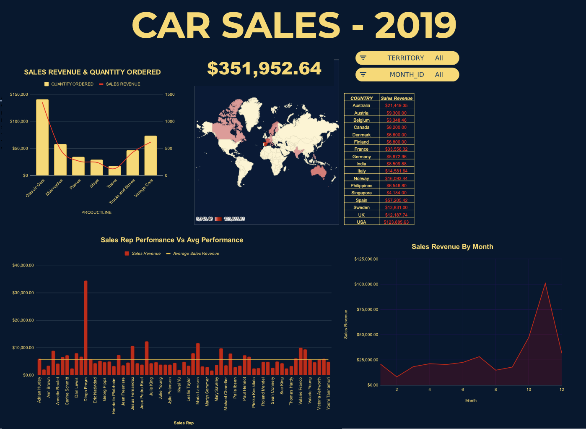

# Mockup-Sales-Data-Insights
A project I practised cleaning data sets and creating effective charts and dashboards through:
* Performing basic functions and formulas like VLOOKUP and pivot tables
* Generating dynamic charts, sparklines, and finding duplicate data entries.
* Using slicers and creating a robust and dynamic dashboard.
* Technologies Used: Google Sheets

  

link to the dashboard: https://docs.google.com/spreadsheets/d/1Pft4hfB6YWe4pLnpJsnx8zCwRrmWh33wbvhR4iCZ5ZA/edit?usp=sharing
